# Architecture

This document provides a visual overview of shc2es architecture and data flow.

## System Architecture

```mermaid
graph TD
    subgraph Hardware["🏠 Hardware Layer"]
        Controller["Bosch Smart Home<br/>Controller II<br/>(Local API)"]
        Devices["ZigBee Devices<br/>(Sensors, etc.)"]
        Devices -->|ZigBee| Controller
    end

    subgraph CLI["🔧 CLI Commands"]
        Poll["poll<br/>(Long Polling)"]
        FetchRegistry["registry<br/>(Device Metadata)"]
        Ingest["ingest<br/>(Batch/Watch)"]
        Dashboard["dashboard<br/>(Export)"]
    end

    subgraph Storage["💾 Local Storage (~/.shc2es/)"]
        direction TB
        EventNDJSON["events-*.ndjson<br/>(Event Data)"]
        Registry["device-registry.json<br/>(Device Names)"]
        Certs["certificates<br/>(Auth)"]
        AppLogs["logs/*.log<br/>(Debug)"]
    end

    subgraph Elastic["☁️ Elastic Stack"]
        direction TB
        ES["Elasticsearch<br/>(Indices + Pipeline)"]
        Kibana["Kibana<br/>(Dashboards)"]
        ES --> Kibana
    end

    subgraph Observability["📊 Observability"]
        OTEL["OpenTelemetry<br/>(Auto-instrumentation)"]
        APM["Elastic APM<br/>(Traces + Metrics)"]
        OTEL -.-> APM
    end

    %% Main Data Flow (solid lines)
    Controller -->|HTTPS| Poll
    Poll --> EventNDJSON
    EventNDJSON --> Ingest
    Ingest -->|Bulk API| ES

    %% Registry Flow
    Controller -->|API| FetchRegistry
    FetchRegistry --> Registry
    Registry -.->|Enrich| Ingest

    %% Dashboard Flow
    Kibana -.->|Export| Dashboard
    Dashboard --> DashboardFile["dashboards/<br/>smart-home.ndjson"]
    DashboardFile -.->|Import| Ingest
    Ingest -.->|Setup| Kibana

    %% Supporting Flows (dashed)
    Poll -.-> AppLogs
    Poll -.-> Certs

    %% OpenTelemetry (dashed for observability)
    Poll -.->|traces| OTEL
    Ingest -.->|traces| OTEL
    FetchRegistry -.->|traces| OTEL
    Dashboard -.->|traces| OTEL

    %% Styling
    classDef hardware fill:#e1f5ff,stroke:#01579b,stroke-width:2px
    classDef storage fill:#fff3e0,stroke:#e65100,stroke-width:2px
    classDef cli fill:#f3e5f5,stroke:#4a148c,stroke-width:2px
    classDef elastic fill:#e8f5e9,stroke:#1b5e20,stroke-width:2px
    classDef observability fill:#fce4ec,stroke:#880e4f,stroke-width:2px

    class Controller,Devices hardware
    class EventNDJSON,Registry,Certs,AppLogs,DashboardFile storage
    class Poll,FetchRegistry,Ingest,Dashboard cli
    class ES,Kibana elastic
    class OTEL,APM observability
```



## Components

### Hardware Layer

- **Bosch Smart Home Controller II**: Central hub that connects ZigBee devices and exposes a local HTTPS API for monitoring and control
- **ZigBee Devices**: Sensors (temperature, humidity, contact), thermostats, switches, and other smart home devices communicating via ZigBee 3.0 (2.4 GHz)

### CLI Commands

#### `shc2es poll` (src/poll.ts)

**Purpose**: Collect real-time events from the Controller II via long polling

**Process**:

1. Load or generate client certificate for authentication
2. Pair with controller if needed (requires physical button press on first run)
3. Subscribe to event stream via HTTPS long polling
4. Write events to daily NDJSON files (`events-YYYY-MM-DD.ndjson`)
5. Log application debug info to `poll-YYYY-MM-DD.log`

**Output**: Continuous stream of smart home events (device state changes, sensor readings, etc.)

#### `shc2es registry` (src/fetch-registry.ts)

**Purpose**: Fetch device and room metadata for data enrichment

**Process**:

1. Query Controller II for device list (`GET /devices`)
2. Query for room assignments (`GET /rooms`)
3. Save combined registry as `device-registry.json`

**Output**: JSON file mapping device IDs to human-readable names and room assignments

#### `shc2es ingest` (src/ingest.ts)

**Purpose**: Import NDJSON events into Elasticsearch for analysis and visualization

**Modes**:

- **Batch**: Process all existing NDJSON files (optionally filtered by glob pattern)
- **Watch**: Monitor for new events in real-time using file watching and tailing

**Process**:

1. Read NDJSON files line by line
2. Enrich events with device/room names from registry
3. Extract normalized metrics (temperature, humidity, battery, etc.)
4. Bulk index to Elasticsearch with ingest pipeline
5. Store in daily indices (`smart-home-events-YYYY-MM-DD`)

**Setup mode** (`--setup`):

- Create Elasticsearch index template (field mappings, settings)
- Create ingest pipeline (document transformation)
- Import Kibana dashboard from `dashboards/smart-home.ndjson`

#### `shc2es dashboard` (src/export-dashboard.ts)

**Purpose**: Export Kibana dashboards for version control

**Process**:

1. Query Kibana saved objects API
2. Export dashboard and dependencies (visualizations, index patterns)
3. Save to `dashboards/` directory as NDJSON

**Use case**: Maintain dashboard definitions in git, import during setup

### Storage

All user data lives in `~/.shc2es/` to keep the package directory clean:

| Location                    | Contents             | Format    | Purpose                                    |
| --------------------------- | -------------------- | --------- | ------------------------------------------ |
| `data/events-*.ndjson`      | Smart home events    | NDJSON    | Raw event data for ingestion               |
| `data/device-registry.json` | Device/room metadata | JSON      | Enrichment data for human-readable names   |
| `logs/poll-*.log`           | Application logs     | Pino JSON | Debug information for `shc2es poll`        |
| `certs/`                    | Client certificates  | PEM       | Authentication with Controller II          |
| `.env`                      | Configuration        | dotenv    | User settings (API endpoints, credentials) |

Bundled with package:

| Location                       | Contents         | Format | Purpose                          |
| ------------------------------ | ---------------- | ------ | -------------------------------- |
| `dashboards/smart-home.ndjson` | Kibana dashboard | NDJSON | Pre-built visualization template |

### Elastic Stack

#### Elasticsearch

**Indices**: Daily indices `smart-home-events-YYYY-MM-DD` for time-based partitioning

**Index Template**: Defines field mappings for:

- `@timestamp`: Event time (date)
- `device.name`, `device.type`: Device information (keyword)
- `room.name`: Room assignment (keyword)
- `metric.name`, `metric.value`: Normalized sensor readings (keyword, float)
- Raw event fields preserved for flexibility

**Ingest Pipeline**: Transforms documents during indexing:

- Extracts metrics from nested state objects
- Normalizes temperature (Celsius), humidity (%), battery (%)
- Adds enrichment fields from device registry

#### Kibana

**Dashboards**: Time series visualizations showing:

- Temperature trends by room
- Humidity levels
- Battery status
- Device state changes

**Index Patterns**: Data views for querying `smart-home-events-*` indices

#### Elastic APM

**Monitoring**: Application performance and error tracking via OpenTelemetry traces

### Observability

**OpenTelemetry**: Automatic instrumentation via `@elastic/opentelemetry-node` (EDOT)

**Instrumented operations**:

- Long polling HTTP requests to Controller II
- NDJSON file reading and parsing
- Elasticsearch bulk indexing
- Kibana API calls

**Service names**:

- `shc2es-poll`: Data collection service
- `shc2es-ingest`: Data ingestion service
- `shc2es-registry`: Device registry fetch
- `shc2es-dashboard`: Dashboard export

**Data sent to APM**: Traces (request spans), metrics (throughput, latency), errors

## Data Flow Scenarios

### Scenario 1: Initial Setup

```
User runs setup commands:
1. shc2es poll          → Generates certificates, pairs with controller
2. shc2es registry      → Fetches device/room names
3. shc2es ingest --setup → Creates ES template/pipeline, imports dashboard
4. shc2es ingest --watch → Starts real-time ingestion
```

**Result**: Complete pipeline from Controller II to Kibana dashboards

### Scenario 2: Continuous Operation

```
Background process:
- shc2es poll          → Continuously writes events to NDJSON files
- shc2es ingest --watch → Tails NDJSON files, ingests to Elasticsearch in real-time

User views:
- Kibana dashboards    → Live visualization of sensor data
- Elastic APM          → Application performance monitoring
```

### Scenario 3: Batch Historical Analysis

```
User has weeks of NDJSON files:
1. shc2es ingest                              → Import all files
2. shc2es ingest --pattern "events-2025-12-*.ndjson" → Import specific month

Result: Historical data available for trend analysis in Kibana
```

### Scenario 4: Dashboard Maintenance

```
Developer customizes dashboards in Kibana:
1. Modify visualizations in Kibana UI
2. shc2es dashboard --list              → Find dashboard ID
3. shc2es dashboard "Smart Home"        → Export to dashboards/
4. Git commit                           → Version control changes

Other users:
- shc2es ingest --setup → Auto-imports latest dashboard version
```

## Configuration

Configuration is centralized in `~/.shc2es/.env`:

```bash
# Required for data collection
BSH_HOST=192.168.x.x
BSH_PASSWORD=your_password

# Required for ingestion
ES_NODE=https://localhost:9200
ES_PASSWORD=changeme

# Optional
KIBANA_NODE=https://localhost:5601
OTEL_EXPORTER_OTLP_ENDPOINT=https://apm.example.com
```

See main [README.md](../README.md) for complete configuration reference.

## Security Considerations

- **Local-first**: Controller II API is local-only (no cloud dependency)
- **Certificate authentication**: Automatic cert generation, stored in `~/.shc2es/certs/`
- **TLS by default**: HTTPS for all API communication
- **Credential isolation**: All secrets in `.env` file (never committed to git)
- **Data encryption**: Events stored as plain NDJSON (encrypt filesystem if needed)

## Technology Stack

- **Runtime**: Node.js v20+ (ESM modules)
- **Language**: TypeScript (compiled to JavaScript)
- **Package Manager**: Yarn 1.x
- **Controller API**: `bosch-smart-home-bridge`
- **Elasticsearch**: `@elastic/elasticsearch` client
- **Logging**: `pino` (structured JSON logging)
- **Observability**: `@elastic/opentelemetry-node` (EDOT auto-instrumentation)
- **File watching**: `chokidar` (real-time ingestion)
- **Testing**: Jest with ts-jest (70%+ coverage)

## Performance Characteristics

- **Long polling latency**: Near real-time (events appear within seconds)
- **NDJSON file size**: ~1-5 KB per event (varies by device type)
- **Daily file rotation**: Automatic at midnight (poll.ts creates new file, ingest.ts handles rotation in watch mode)
- **Elasticsearch bulk size**: 500 documents per bulk request (configurable)
- **Watch mode overhead**: Minimal (chokidar + tail-file libraries)

## Limitations & Known Issues

- **No automatic retention**: Elasticsearch indices and NDJSON files grow indefinitely (set up ILM manually)
- **Single controller**: One Controller II per shc2es instance
- **No buffering**: If Elasticsearch is down, watch mode logs errors but doesn't queue events (batch mode can reprocess NDJSON)
- **Midnight rotation**: Watch mode file rotation at midnight has edge-case handling (tested manually, integration test planned)
